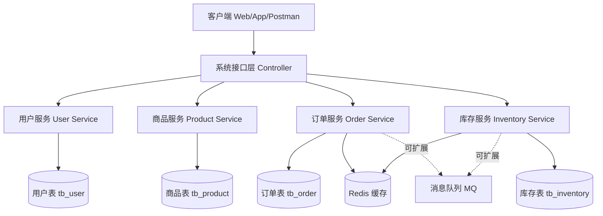
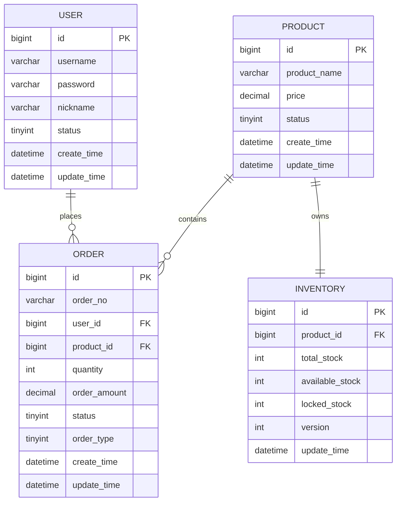

# 商品库存与秒杀系统设计文档

## 1. 文档概述

### 1.1 项目名称

商品库存与秒杀系统

### 1.2 项目背景

随着电商系统的发展，库存管理和高并发秒杀已经成为常见业务场景。普通商品系统主要关注商品展示、库存维护和订单处理，而秒杀场景对系统性能、并发控制和库存一致性提出了更高要求。如果系统设计不合理，容易出现超卖、重复下单、数据库压力过大等问题。

因此，本项目设计一个面向商品库存与秒杀场景的后端系统，通过对用户、商品、库存、订单等模块进行拆分，构建一个结构清晰、扩展性较好的系统原型，并在设计层面体现秒杀业务下的高并发处理思路。

### 1.3 项目目标

本项目的主要目标如下：

1. 设计一个完整的商品库存与秒杀系统架构
2. 明确系统中各服务的职责划分
3. 定义核心 RESTful API 接口
4. 设计数据库表结构及实体关系
5. 选择适合课程作业实现的技术栈
6. 为后续编码实现提供清晰依据

### 1.4 设计原则

本系统在设计时遵循以下原则：

1. 职责清晰  
   各服务只负责本领域内的业务，降低模块耦合度。

2. 易于实现  
   优先采用适合初学者掌握的技术方案，保证课程作业可落地。

3. 易于扩展  
   在基础功能实现的前提下，为后续接入 Redis、消息队列、限流等优化手段预留空间。

4. 保证一致性  
   重点考虑库存扣减、订单生成过程中的一致性问题，减少超卖风险。

---

## 2. 系统总体设计

### 2.1 系统功能概述

本系统围绕以下四个核心业务模块展开：

1. 用户服务  
   负责用户注册、登录、用户信息管理。

2. 商品服务  
   负责商品信息维护、商品查询、商品上下架。

3. 库存服务  
   负责库存查询、库存扣减、库存锁定、库存回滚。

4. 订单服务  
   负责订单创建、订单查询、订单取消、秒杀订单处理。

### 2.2 系统总体架构说明

系统采用分层与模块化结合的设计思路。在业务设计层面，将系统拆分为用户服务、商品服务、订单服务、库存服务四个服务。在实现阶段，为降低开发复杂度，优先采用单体模块化工程实现。后续如果需要升级为微服务架构，只需要将各业务模块独立部署即可。

系统主要由以下几部分组成：

1. 客户端  
   用户通过浏览器、移动端或接口测试工具访问系统。

2. 接口层  
   统一接收请求，对参数进行校验，并调用业务逻辑层处理。

3. 业务层  
   实现注册登录、商品管理、下单、库存扣减等具体业务逻辑。

4. 数据访问层  
   通过 MyBatis 访问 MySQL 数据库。

5. 数据存储层  
   采用 MySQL 存储核心业务数据，后续可引入 Redis 实现高并发缓存处理。

### 2.3 系统架构草图



### 2.4 服务拆分说明

#### 2.4.1 用户服务

用户服务负责系统中与用户身份相关的业务操作，主要包括：

1. 用户注册
2. 用户登录
3. 用户信息查询
4. 用户状态管理

该服务是系统的基础入口，后续商品下单、订单查询等功能都依赖用户身份信息。

#### 2.4.2 商品服务

商品服务负责商品信息的管理，主要包括：

1. 商品新增
2. 商品修改
3. 商品详情查询
4. 商品列表查询
5. 商品上下架

商品服务主要维护商品的静态信息，例如商品名称、价格、描述和状态等。

#### 2.4.3 库存服务

库存服务是本系统的关键模块之一，主要负责：

1. 查询商品库存
2. 扣减库存
3. 回滚库存
4. 锁定库存
5. 处理并发场景下的库存安全问题

在秒杀业务中，库存服务承担高并发控制的重要职责。

#### 2.4.4 订单服务

订单服务负责用户下单与订单状态流转，主要包括：

1. 创建普通订单
2. 创建秒杀订单
3. 查询订单详情
4. 查询用户订单列表
5. 取消订单

订单服务通常需要与商品服务和库存服务协同工作，在确认商品信息和库存可用后生成订单记录。

---

## 3. 秒杀业务流程设计

### 3.1 普通下单流程

普通商品下单流程如下：

1. 用户登录系统
2. 用户选择商品并提交下单请求
3. 订单服务调用库存服务查询库存
4. 若库存充足，则执行库存扣减
5. 扣减成功后生成订单
6. 返回下单成功结果

### 3.2 秒杀下单流程

秒杀场景下，系统处理流程如下：

1. 用户发起秒杀请求
2. 系统校验用户是否登录、商品是否在秒杀时间内
3. 系统判断用户是否重复下单
4. 订单服务调用库存服务尝试扣减库存
5. 若库存扣减成功，则生成秒杀订单
6. 若库存不足，则返回秒杀失败
7. 可选地将请求放入消息队列异步处理，用于高并发削峰

### 3.3 秒杀核心问题

在秒杀场景中，需要重点考虑以下问题：

1. 高并发请求同时到达
2. 数据库压力增大
3. 库存扣减竞争激烈
4. 可能发生超卖
5. 用户重复下单
6. 服务响应变慢甚至雪崩

### 3.4 秒杀优化思路

为应对上述问题，本系统设计中预留以下优化方案：

1. Redis 缓存库存  
   将热点商品库存缓存在 Redis 中，减少数据库直接访问频率。

2. 接口限流  
   限制单位时间内进入系统的请求数量，防止瞬时流量过大。

3. 乐观锁控制  
   在库存表中加入版本号字段，通过更新条件控制并发扣减。

4. 消息队列削峰  
   将秒杀请求异步写入队列，订单服务按顺序消费，平滑流量峰值。

5. 防重复下单  
   针对同一用户同一商品进行唯一性判断，防止恶意重复抢购。

---

## 4. RESTful API 接口设计

### 4.1 接口设计原则

本系统接口遵循 RESTful 风格，主要原则如下：

1. 使用统一的资源路径命名
2. 使用 HTTP 动词表示操作类型
3. 使用 JSON 作为数据交换格式
4. 路径语义清晰、层次明确

### 4.2 用户服务 API

#### 4.2.1 用户注册

**接口路径**

`POST /api/users/register`

**功能说明**

注册新用户。

**请求参数**

| 参数名 | 类型 | 是否必填 | 说明 |
| --- | --- | --- | --- |
| username | String | 是 | 用户名 |
| password | String | 是 | 密码 |
| nickname | String | 是 | 昵称 |

**请求示例**

```json
{
  "username": "zhangsan",
  "password": "123456",
  "nickname": "张三"
}
```

**响应示例**

```json
{
  "code": 200,
  "message": "success",
  "data": 1
}
```

#### 4.2.2 用户登录

**接口路径**

`POST /api/users/login`

**功能说明**

用户登录系统。

**请求参数**

| 参数名 | 类型 | 是否必填 | 说明 |
| --- | --- | --- | --- |
| username | String | 是 | 用户名 |
| password | String | 是 | 密码 |

**请求示例**

```json
{
  "username": "zhangsan",
  "password": "123456"
}
```

**响应示例**

```json
{
  "code": 200,
  "message": "success",
  "data": {
    "userId": 1,
    "username": "zhangsan",
    "nickname": "张三"
  }
}
```

#### 4.2.3 查询用户信息

**接口路径**

`GET /api/users/{id}`

**功能说明**

根据用户 ID 查询用户详情。

---

### 4.3 商品服务 API

#### 4.3.1 新增商品

**接口路径**

`POST /api/products`

**功能说明**

新增商品。

#### 4.3.2 查询商品详情

**接口路径**

`GET /api/products/{id}`

**功能说明**

查询商品详细信息。

#### 4.3.3 查询商品列表

**接口路径**

`GET /api/products`

**功能说明**

分页查询商品列表。

#### 4.3.4 修改商品信息

**接口路径**

`PUT /api/products/{id}`

**功能说明**

修改商品信息。

#### 4.3.5 商品上下架

**接口路径**

`PATCH /api/products/{id}/status`

**功能说明**

修改商品状态。

---

### 4.4 库存服务 API

#### 4.4.1 查询库存

**接口路径**

`GET /api/inventories/{productId}`

**功能说明**

查询指定商品库存。

#### 4.4.2 更新库存

**接口路径**

`PUT /api/inventories/{productId}`

**功能说明**

初始化或调整商品库存。

#### 4.4.3 扣减库存

**接口路径**

`POST /api/inventories/{productId}/deduct`

**功能说明**

扣减指定商品库存。

#### 4.4.4 回滚库存

**接口路径**

`POST /api/inventories/{productId}/restore`

**功能说明**

订单取消或异常时恢复库存。

#### 4.4.5 锁定库存

**接口路径**

`POST /api/inventories/{productId}/lock`

**功能说明**

先锁定库存，后续再正式扣减。

---

### 4.5 订单服务 API

#### 4.5.1 普通下单

**接口路径**

`POST /api/orders`

**功能说明**

创建普通订单。

#### 4.5.2 秒杀下单

**接口路径**

`POST /api/orders/seckill`

**功能说明**

创建秒杀订单。

**请求示例**

```json
{
  "userId": 1,
  "productId": 101,
  "quantity": 1
}
```

#### 4.5.3 查询订单详情

**接口路径**

`GET /api/orders/{id}`

**功能说明**

根据订单 ID 查询订单信息。

#### 4.5.4 查询用户订单列表

**接口路径**

`GET /api/orders/user/{userId}`

**功能说明**

查询某个用户的订单列表。

#### 4.5.5 取消订单

**接口路径**

`PATCH /api/orders/{id}/cancel`

**功能说明**

取消订单并触发库存回滚。

---

## 5. 数据库设计

### 5.1 数据库设计说明

本系统数据库主要包括以下四张核心表：

1. 用户表 `tb_user`
2. 商品表 `tb_product`
3. 库存表 `tb_inventory`
4. 订单表 `tb_order`

设计时重点考虑以下关系：

1. 一个用户可以拥有多个订单
2. 一个商品对应一条库存记录
3. 一个商品可以出现在多个订单中

### 5.2 ER 图



### 5.3 表结构设计

#### 5.3.1 用户表 `tb_user`

| 字段名 | 类型 | 主键 | 说明 |
| --- | --- | --- | --- |
| id | BIGINT | 是 | 用户主键 |
| username | VARCHAR(50) | 否 | 用户名，唯一 |
| password | VARCHAR(100) | 否 | 加密后的密码 |
| nickname | VARCHAR(50) | 否 | 昵称 |
| status | TINYINT | 否 | 用户状态 |
| create_time | DATETIME | 否 | 创建时间 |
| update_time | DATETIME | 否 | 更新时间 |

#### 5.3.2 商品表 `tb_product`

| 字段名 | 类型 | 主键 | 说明 |
| --- | --- | --- | --- |
| id | BIGINT | 是 | 商品主键 |
| product_name | VARCHAR(100) | 否 | 商品名称 |
| price | DECIMAL(10,2) | 否 | 商品价格 |
| status | TINYINT | 否 | 商品状态 |
| create_time | DATETIME | 否 | 创建时间 |
| update_time | DATETIME | 否 | 更新时间 |

#### 5.3.3 库存表 `tb_inventory`

| 字段名 | 类型 | 主键 | 说明 |
| --- | --- | --- | --- |
| id | BIGINT | 是 | 库存主键 |
| product_id | BIGINT | 否 | 商品 ID |
| total_stock | INT | 否 | 总库存 |
| available_stock | INT | 否 | 可用库存 |
| locked_stock | INT | 否 | 已锁定库存 |
| version | INT | 否 | 乐观锁版本号 |
| update_time | DATETIME | 否 | 更新时间 |

#### 5.3.4 订单表 `tb_order`

| 字段名 | 类型 | 主键 | 说明 |
| --- | --- | --- | --- |
| id | BIGINT | 是 | 订单主键 |
| order_no | VARCHAR(64) | 否 | 订单编号 |
| user_id | BIGINT | 否 | 用户 ID |
| product_id | BIGINT | 否 | 商品 ID |
| quantity | INT | 否 | 购买数量 |
| order_amount | DECIMAL(10,2) | 否 | 订单总金额 |
| status | TINYINT | 否 | 订单状态 |
| order_type | TINYINT | 否 | 订单类型，普通订单或秒杀订单 |
| create_time | DATETIME | 否 | 创建时间 |
| update_time | DATETIME | 否 | 更新时间 |

### 5.4 库存并发控制设计

为了应对并发扣减库存问题，库存表中引入 `version` 字段实现乐观锁控制。

库存扣减逻辑可以设计为：

1. 先查询当前库存和版本号
2. 扣减库存时带上版本号作为更新条件
3. 只有版本一致时才更新成功
4. 更新成功后版本号加一
5. 如果更新失败，说明存在并发竞争，需要重试或返回失败

这样可以在一定程度上减少高并发场景下的超卖问题。

---

## 6. 技术栈选型说明

### 6.1 编程语言

选择 Java 作为开发语言。

选择原因如下：

1. Java 是企业级开发中的主流语言
2. 生态成熟，资料丰富，适合课程项目开发
3. 与 Spring Boot、MyBatis、MySQL 等技术搭配成熟
4. 便于后续扩展微服务与中间件

### 6.2 后端框架

选择 Spring Boot 作为后端开发框架。

选择原因如下：

1. 上手快，配置简单
2. 能快速搭建 Web 项目
3. 社区活跃，文档丰富
4. 适合作为中小型课程项目的基础框架

### 6.3 持久层框架

选择 MyBatis 作为数据库访问框架。

选择原因如下：

1. SQL 可控性强
2. 便于理解数据库操作过程
3. 适合初学者学习表结构与 SQL 映射关系
4. 对课程作业中的增删改查实现较直观

### 6.4 数据库

选择 MySQL 作为关系型数据库。

选择原因如下：

1. 安装和使用方便
2. 支持事务，适合订单和库存场景
3. 与 Java Web 项目配合成熟
4. 便于完成课程作业演示

### 6.5 缓存中间件

选择 Redis 作为缓存组件。

选择原因如下：

1. 读写性能高
2. 适合缓存热点库存数据
3. 可用于秒杀场景中的计数、去重和快速判断
4. 后续可支持分布式锁、限流等功能

### 6.6 构建工具

选择 Maven 作为项目构建工具。

选择原因如下：

1. Java 项目中使用广泛
2. 依赖管理方便
3. 与 Spring Boot 集成成熟
4. 适合课程作业中的工程构建和打包

### 6.7 版本管理工具

选择 Git 作为版本管理工具。

选择原因如下：

1. 便于代码版本维护
2. 适合团队协作与个人开发
3. 可以完整记录项目迭代过程
4. 有利于课程作业展示工程化意识

